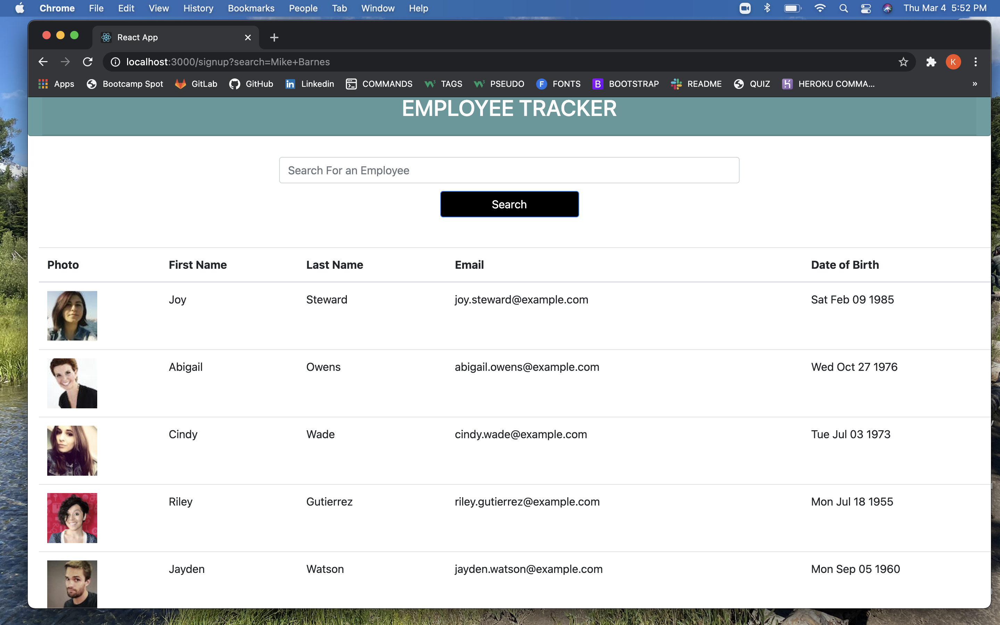
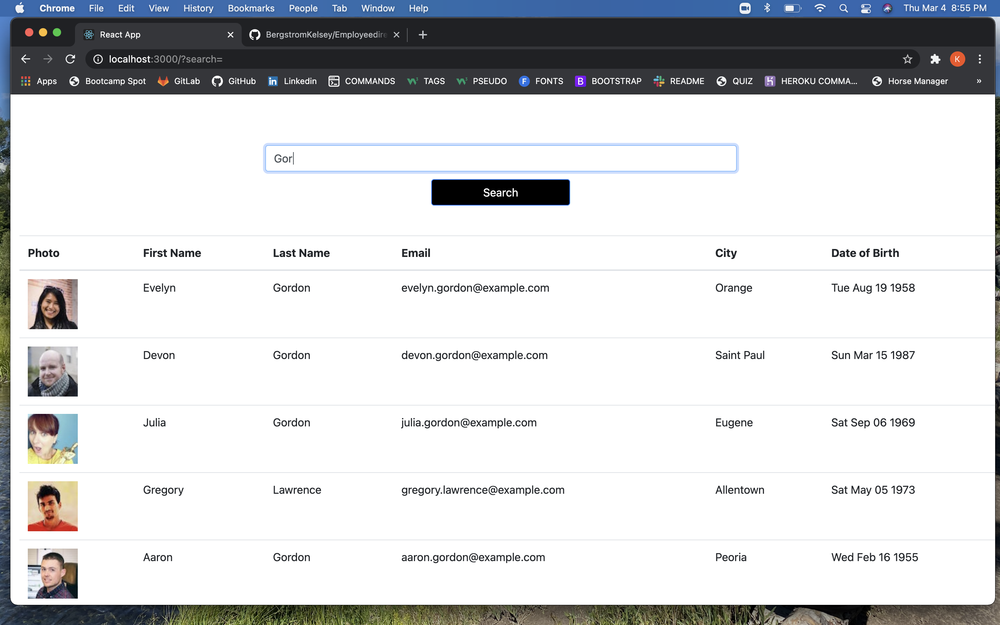
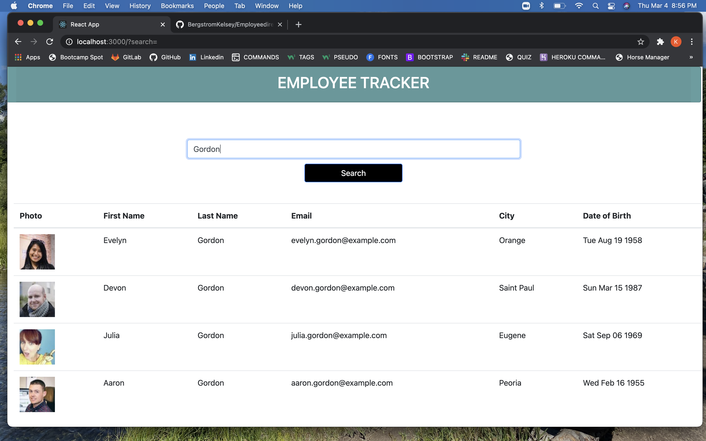

## Employee Directory

# Description
Employee Directory is an application that allows employees and managers alike to search and keep track of employee data. In the application, users can search for specific employees by their first and last name. Upon search, each character typed by the user will be recognized and any employee with matching characters will begin to populate in a list below. Users will be presented with the employees photo, First name, Last name, Email address, Location and Date of Birth.

## Screenshots
- 	
- 	
- 	

# Tools Utilized 
Employee Directory Utlizes the following:

- CSS
- Bootstrap
- React
- JavaScript
- Axios

# Usage 
The application can be accessed via Heroku: 

https://employeedirt.herokuapp.com/

